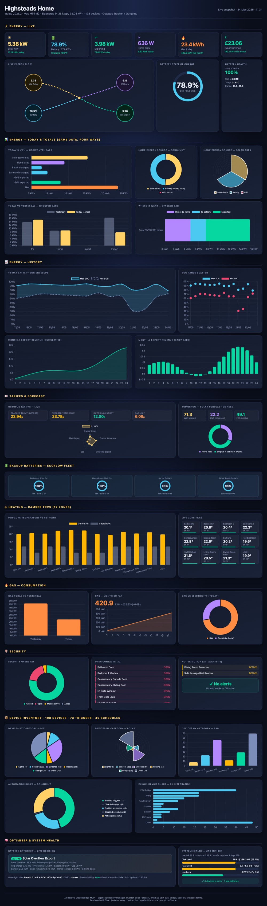

# EnergyDashboard-Example

A comprehensive live energy dashboard for [Indigo Domotics](https://www.indigodomo.com), demonstrating what's possible when you combine the
[Indigo HTML pages skill](https://github.com/simons-plugins/indigo-claude-plugin) (credit: [@simons-plugins](https://github.com/simons-plugins)),
the [Dashboards plugin](https://github.com/Highsteads/Dashboards), Claude Code and a few hours' worth of "what if it could also show…".

This is a **worked example** — wired specifically to my (Highsteads / CliveS) setup. The point of it being on GitHub is to give other Indigo users a working dashboard
they can read, copy and adapt to their own kit. Almost everything except the device IDs at the top of the file is generic.



## What's in the dashboard

Every section live-polls the Indigo REST API every 5 seconds:

- **Hero strip** — solar, battery SOC, grid flow, home draw, gas, monthly export revenue
- **Live energy flow** — animated SVG showing solar → battery / home / grid in real time
- **Battery SOC gauge + health card** (SoH, cell voltage, temperature range)
- **Today's totals** — same data shown several different ways (bars, donut, polar area, stacked, today-vs-yesterday)
- **Tariffs** — import today / tomorrow, export, gas, plus a comparison radar
- **Tomorrow forecast** — solar vs need, surplus headed for battery/export
- **Backup batteries** — auto-discovered SOC rings for any device with a `batteryLevel` state (UPS, portable power stations, EcoFlow, Bluetti, etc.)
- **Heating zones** — auto-discovered from any thermostat device (Insteon, Z-Wave, Nest, Ecobee, EvoHome, RAMSES, generic Indigo) with bar chart + interactive tiles with +/− buttons that change the setpoint live
- **Gas consumption** — today vs yesterday, month-so-far, gas-vs-electricity
- **Security overview** — donut, list of open contacts, active motion, alerts
- **Device inventory** — by category (three views), automation rule counts, plugin device share
- **Optimiser** — live decision text from any battery/energy manager device that publishes one (optional)
- **System health** — total device count, healthy vs errored

The screenshot below shows my own setup (Sigenergy solar/battery, RAMSES heating, EcoFlow backup batteries, Octopus tariffs). Yours will look different
depending on what's wired in — sections auto-adapt or hide cleanly.

## Prerequisites

- **Indigo 2024.2 or later** with HTTP API enabled
- An **API key** — Indigo → Server Configuration → Settings → REST API
- **A serving plugin** (optional but recommended) — either:
  - The [Dashboards plugin](https://github.com/Highsteads/Dashboards) (cleanest — drop the file in `Contents/Resources/static/pages/` and it appears in the Dashboards index automatically), or
  - Any other plugin's `Contents/Resources/static/pages/` directory, or
  - **No plugin at all** — open the HTML in a browser; it'll prompt for your Indigo URL and API key

## Quick install

```bash
git clone https://github.com/Highsteads/EnergyDashboard-Example.git
cd EnergyDashboard-Example

# Option A: Dashboards plugin (if installed)
cp pages/energy-showcase.html "/Library/Application Support/Perceptive Automation/Indigo 2025.2/Plugins/Dashboards.indigoPlugin/Contents/Resources/static/pages/"

# Option B: Standalone — just open in a browser
open pages/energy-showcase.html
```

Then edit `pages/energy-showcase.html` and replace the IDs in the `ID` config block at the top with the ones from your own Indigo setup
(see [docs/customising.md](docs/customising.md) for a step-by-step walkthrough).

## Cost-per-device calculation script

The `scripts/calculate_device_costs.py` script reads device power readings from SQL Logger, integrates W into kWh over hourly / daily windows,
multiplies by whichever Octopus rate was active in each period, and writes the results back into Indigo variables. Once those variables exist, the
dashboard can chart them just like everything else.

See `scripts/README.md` for installation and configuration.

## How was this built?

- **Claude Code** (Anthropic) — wrote the HTML, CSS, all the Chart.js config, the SVG flow diagram and the polling logic
- **[indigo-claude-plugin](https://github.com/simons-plugins/indigo-claude-plugin)** — provided the HTML pages skill that gave Claude the IndigoAPI class, polling conventions, dark-mode plumbing, touch targets and the page-discovery meta tags. Without it the build would have taken much longer and been half-right.
- **[ClaudeBridge MCP](https://github.com/Highsteads/ClaudeBridge)** — let Claude fetch live device data and restart the plugin in one go
- **[Chart.js 4.4](https://www.chartjs.org)** — the rendering engine

Total wall-clock time, prompt to deployed live page: roughly 5 minutes.

## Adapting for your setup

The CONFIG block at the top of `pages/energy-showcase.html` is role-based — you map your own devices to logical roles like "energy device that publishes
solar power" rather than naming specific plugins. The page works with:

- **Any inverter / energy monitor** that publishes solar power, battery SOC, grid power and home consumption (Sigenergy, Solis, Enphase, generic Shelly EM with custom states, etc.)
- **Any thermostat device** for the heating section (auto-discovered — no config needed)
- **Any device with a `batteryLevel` state** for the backup batteries section (auto-discovered)
- **Indigo variables** for tariff and gas data — variable names are configurable
- **SQL Logger** for the per-device cost script (optional)

See [docs/customising.md](docs/customising.md) for the full config walk-through plus example mappings for common setups.

If you only have some of these (e.g. solar but no battery, or thermostats but no solar), the missing sections show "no data configured" rather than break.

## Optional: the `IndigoSecrets.py` pattern

I keep my API keys, server URLs and other sensitive values in a single file at
`/Library/Application Support/Perceptive Automation/IndigoSecrets.py` rather than in PluginConfig dialogs or hard-coded into scripts. As far as I know nobody
else does it this way, but it works for me across all my plugins so I have wired the same pattern through here. **It is entirely optional** — nothing in
this repo requires it. `IndigoSecrets_example.py` is shipped at the repo root as a template if you fancy adopting it too.

See [docs/secrets-pattern.md](docs/secrets-pattern.md) for the full explanation of how it works, the canonical import pattern, and where it's useful (e.g. if
you decide to extend the cost-calc script with a direct Octopus API fetcher rather than relying on an existing plugin).

If you don't use the pattern, just ignore this — everything works without it.

## Licence

MIT — see [LICENSE](LICENSE). Use it, fork it, butcher it, take ideas from it. If you build something nice on top, drop a link in the Indigo forum thread.

## Credits

- **[@simons-plugins](https://github.com/simons-plugins)** — for the [indigo-claude-plugin](https://github.com/simons-plugins/indigo-claude-plugin) HTML pages skill that did most of the heavy conventions lifting
- **[Perceptive Automation](https://www.indigodomo.com)** — for building Indigo and keeping its API genuinely usable
- **The Indigo forum community** — for the conversation that prompted this in the first place
